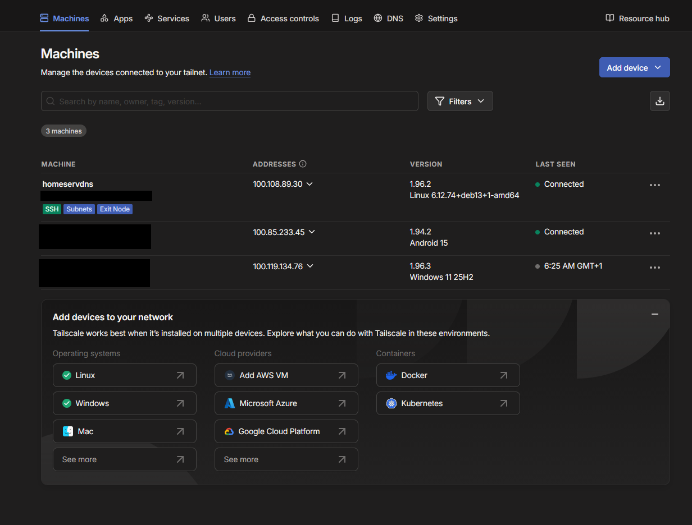
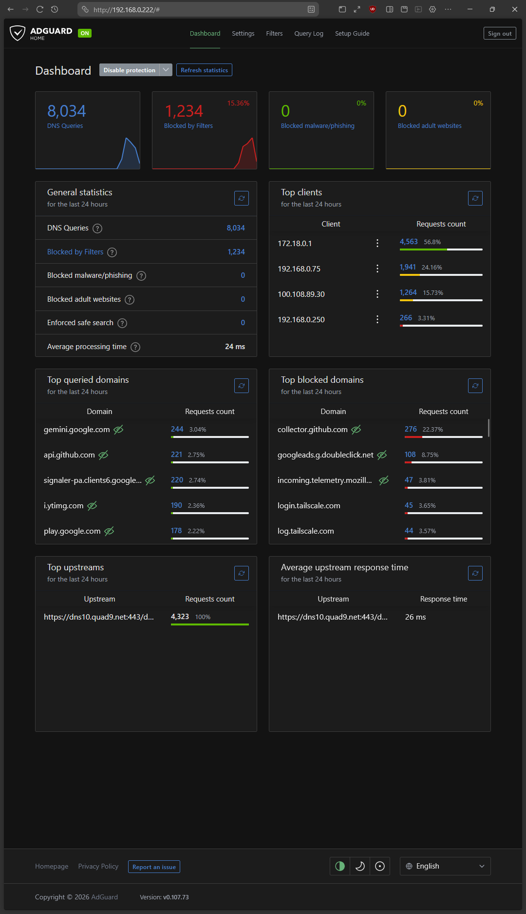
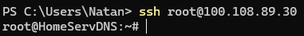

# Zero Trust Homelab Gateway & DNS Sinkhole 🛡️


This project documents the transformation of legacy hardware into a headless, highly efficient **Zero Trust Network Access** gateway and network-wide ad blocker. The goal was to build a secure, remotely accessible home infrastructure utilizing containerization and modern VPN protocols without opening any inbound ports on the edge router.

## 🛠️ Technologies
* **Operating System:** Debian Linux.
* **Containerization:** Docker & Docker Compose.
* **Network Security:** Tailscale.
* **DNS Sinkholing:** AdGuard Home.
* **Access Control:** Identity-based authentication.

## ✨ Features

### 1. Network-wide Ad & Tracker Blocking
Deployed **AdGuard Home** within a Docker container to intercept and filter DNS requests. Integrated aggressive, community-maintained blocklists to actively prevent telemetry, malware and ads at the network level.

### 2. Zero Trust Mesh VPN
Configured the server as a **Tailscale Exit Node**. This allows mobile devices (on public Wi-Fi or LTE) to establish an encrypted WireGuard tunnel directly to the server, masking their public IP and forcing all traffic through the AdGuard DNS filter.

### 3. Advanced Tailscale Integration
To fully leverage the Zero Trust architecture, I implemented several advanced networking features:
* **Tailscale SSH:** Eliminated the need for traditional SSH keys and passwords. Access to the server's terminal is now authenticated via the identity provider and authorized exclusively through the Tailscale mesh network.
* **Subnet Routing:** Configured the Debian server to act as a gateway to the local physical network, allowing secure remote access to non-Tailscale IoT devices (e.g., printers, smart home hubs).
* **Taildrop:** Enabled encrypted, peer-to-peer file transfers across all connected devices in the mesh network.

## ⚙️ The Process

### Phase 1: Headless Provisioning & Infrastructure as Code
The server was built on a minimal Debian installation to ensure low overhead. After disabling sleep states for lid-closure, I deployed the Docker engine. To ensure reproducibility and easy migration, the entire AdGuard Home environment was codified using a `docker-compose.yml` file with persistent volume mapping.

### Phase 2: ZTNA & MagicDNS Integration
After deploying Tailscale on the host network layer, I configured IP forwarding (`net.ipv4.ip_forward`) in the Linux kernel to allow the server to route packets for other devices. Finally, I configured Tailscale's MagicDNS to globally override DNS settings, ensuring that any device joining the mesh network automatically queries the Dockerized AdGuard container for name resolution.

## 📊 Proof of Concept / Testing

### ZTNA Infrastructure Deployment
Successfully deployed the Tailscale mesh network. The Debian server acts as the primary Exit Node and Subnet Router, managing traffic for connected endpoint devices.


<br>*> Tailscale admin console confirming active node roles.*

### Remote Ad-Blocking & DNS Sinkholing
Connected a smartphone via LTE to the Tailscale network. Verified that ads were successfully dropped by monitoring the live Query Log and dashboard statistics.


<br>*> AdGuard Home dashboard showing active network filtering.*

### Passwordless SSH Authentication
Attempted to access the server via port 22 from an unauthorized IP (Connection Refused). Then, successfully established an SSH session utilizing identity-based access control via the Tailscale mesh.


<br>*> Successful passwordless SSH connection via WireGuard tunnel.*

## 💡 What I Learned
* **Docker Networking:** Gained practical experience mapping container ports to the host interface and managing persistent storage volumes for stateful applications.
* **DNS Limitations:** Learned that DNS sinkholing effectively blocks domain-based ads but cannot filter elements served from the same domain as the primary content, highlighting the need for a Defense in Depth approach.
* **Zero Trust Paradigm:** Transitioned from the traditional "castle-and-moat" security model (relying on edge firewalls and port forwarding) to an identity-first perimeter, understanding how Tailscale utilizes NAT traversal to establish direct P2P connections.

## 🚀 How to run the Project

1. Clone this repository to your server.
2. Execute the host provisioning script to install Tailscale and configure IP forwarding:
   ```bash
   chmod +x setup_host.sh
   sudo ./setup_host.sh
3. Navigate to the project directory containing the `docker-compose.yml` file.
4. Deploy the DNS container in detached mode:
   ```bash
   docker compose up -d
   ```
5. Access the AdGuard Home WebGUI on `http://[YOUR_SERVER_IP]:3000` to complete the initial setup.
6. In your Tailscale Admin Console, set your server's Tailscale IP as the Global Nameserver and enable "Override local DNS".
